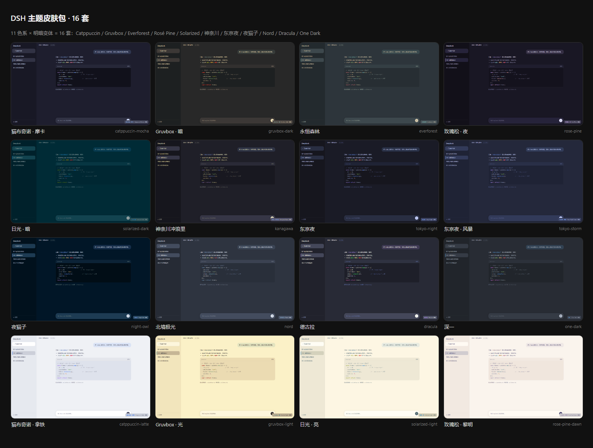

# dsh-theme-pack

**16 套第三方主题皮肤，给 [DeepSeek Harness](https://github.com/deepseek-ai/deepseek-harness)（DSH）Web GUI 换肤。**

> 16 community theme skins for the DeepSeek Harness Web GUI — Catppuccin, Gruvbox, Everforest, Rosé Pine, Solarized, Kanagawa, Tokyo Night, Night Owl, Nord, Dracula, One Dark, with both dark and light variants where the source palette defines them.



---

## 主题清单 · Themes

| # | 主题 | id | 明/暗 |
|---|---|---|---|
| 1 | 猫布奇诺 · 摩卡 Catppuccin Mocha | `catppuccin-mocha` | 🌙 |
| 2 | 猫布奇诺 · 拿铁 Catppuccin Latte | `catppuccin-latte` | ☀️ |
| 3 | Gruvbox · 暗 Gruvbox Dark | `gruvbox-dark` | 🌙 |
| 4 | Gruvbox · 光 Gruvbox Light | `gruvbox-light` | ☀️ |
| 5 | 永恒森林 Everforest | `everforest` | 🌙 |
| 6 | 玫瑰松 · 夜 Rosé Pine | `rose-pine` | 🌙 |
| 7 | 玫瑰松 · 黎明 Rosé Pine Dawn | `rose-pine-dawn` | ☀️ |
| 8 | 日光 · 暗 Solarized Dark | `solarized-dark` | 🌙 |
| 9 | 日光 · 亮 Solarized Light | `solarized-light` | ☀️ |
| 10 | 神奈川冲浪里 Kanagawa Wave | `kanagawa` | 🌙 |
| 11 | 东京夜 Tokyo Night | `tokyo-night` | 🌙 |
| 12 | 东京夜 · 风暴 Tokyo Night Storm | `tokyo-storm` | 🌙 |
| 13 | 夜猫子 Night Owl | `night-owl` | 🌙 |
| 14 | 北境极光 Nord | `nord` | 🌙 |
| 15 | 德古拉 Dracula | `dracula` | 🌙 |
| 16 | 深一 One Dark | `one-dark` | 🌙 |

每套主题的单张预览图见 [`previews/`](previews/) 目录（1440×860，Edge headless 实拍 GUI 模拟页）。

## 特性

- **零侵入**：不重写任何样式表，只覆盖 DSH 主题契约暴露的 `--dsw-alias-*` / `--dsw-specific-*` 语义 token（每套 80 个）；未覆盖的 token 自动回落到内建调色板
- **免构建链**：客户端 bundle 是手写的 lazy CJS（`window.__ModuleLoader__.load`），直接可装载，不需要 tsdown/vite
- **自带选择器**：在 设置 → 通用 注入「主题皮肤（16 套）」面板，色点立方点选即换肤，中英文案齐全
- **数据源单一**：16 套主题的全部颜色只由 [`src/palettes.mjs`](src/palettes.mjs) 一份调色板文件派生，映射规则集中在 [`src/tokens.mjs`](src/tokens.mjs)

## 安装

前提：已安装 [DSH](https://github.com/deepseek-ai/deepseek-harness) 并有 `web` profile（`dsh web` 可用）。

```powershell
# 1) 把本仓库装进 web profile（git 依赖，走 pnpm）
dsh plugin --profile web add git+https://github.com/math-lrz/dsh-theme-pack.git
dsh plugin --profile web add dsh-theme-pack   # npm 安装（装完自动挂载，无需手动 insert）
```

```yaml
# 2) 编辑 %USERPROFILE%\.dsh\profiles\web\cordis.patch.yml，追加一条 loader 插入：
#    （name 必须是包名而不是 file:/// 路径，否则 client-modules 扫不到客户端 bundle）
- insert:
    - id: dsh-theme-pack
      name: 'dsh-theme-pack'
```

3) 刷新浏览器页面（patch 改动触发热重挂，通常**不需要重启** `dsh web`）。

## 使用

**设置 → 通用 → 外观** 下方出现「主题皮肤（16 套）」：16 个色点立方（底 / 主强调 / 成功 / 错误 四色速览），点击立即换肤；内建的 浅色 / 深色 / 跟随系统 继续可用，随时切回。

## 工作原理

DSH 的主题契约由 `@deepseek-ai/dsh-client-ui-theme` 定义：

```
ThemeRuntime.register({ id, colorScheme, tokens })   // 注册第三方主题
            │  tokens: { '--dsw-alias-*': '<css color>', ... }
            ▼
ui-layout 的 ThemePresenter 把 tokens 以 inline style 写到 <body>，
并按 colorScheme 设置 body[data-ds-dark-theme] 与 color-scheme
```

本插件的客户端 bundle 做三件事：

1. `ctx.theme.register(...)` × 16（每次注册都挂在 `ctx.effect` 上，插件卸载时逆序回收）；
2. 往 `settings.general.item` 插槽注册主题选择器组件（复用内建「外观」行的 store / locale / inject 模式）；
3. 注册 `settings.themePack` 中英文案。

host 半侧（`lib/index.mjs`）是一个 no-op 插件——它存在的唯一意义是让 cordis Loader 有一条可加载的条目，`dsh-client-modules` 的扫描器才会把包名解析进客户端 boot 图，浏览器再经 `/plugins/dsh-theme-pack/client.js` 拿到真正的 bundle。

## 目录结构

```
src/palettes.mjs    16 套调色板原色（唯一数据源，改色/加主题只动这里）
src/tokens.mjs      调色板 → 80 个语义 token 的映射器
scripts/build.mjs   生成器：themes.json + client.js + preview/*.html
scripts/smoke.mjs   冒烟测试：模拟 cordis ctx 验证 16 主题注册与插槽注入
lib/themes.json     机读主题定义（id / colorScheme / label / swatches / tokens）
lib/client.js       生成的客户端 bundle（勿手改）
lib/index.mjs       host 半侧 no-op 入口
preview/            每套主题的 GUI 预览页（截图源）
previews/           渲染好的 PNG 预览图
```

## 开发

```powershell
node scripts/build.mjs     # 改完 palettes.mjs 后重新生成全部产物
node scripts/smoke.mjs     # 冒烟测试（16 主题 × 80 token、插槽、词典）

# 重新出预览图（需要本机 Edge）：
& "C:\Program Files (x86)\Microsoft\Edge\Application\msedge.exe" --headless=new --disable-gpu `
  --hide-scrollbars --window-size=1440,860 --screenshot=previews\<id>.png `
  "file:///<本仓库绝对路径>/preview/<id>.html"
```

**加一套新主题**：在 `src/palettes.mjs` 里追加一个调色板对象（`id` / `scheme` / `bg` / `fg` / `blue` / 状态色 / `syn` 语法高亮），跑 `build.mjs` 即可——token 映射、选择器、文案、预览页全部自动派生。

## 已知限制

- **主题选择不持久化**（上游限制）：`ui-theme.preference` 的内建设置 schema 只认 `light / dark / system`，第三方主题 id 只在进程内有效（见 dsh-client-ui-theme README「Known Limitations」）。刷新页面后回到内建外观，需重新点选。
- 远程（非本机）浏览器同样可选但不持久。
- 遮罩类 token（`--dsw-alias-bg-mask-*`）刻意沿用内建默认值，未纳入皮肤映射。

## License

[MIT](LICENSE) © 2026 math-lrz

各主题调色板的版权归原主题作者（Catppuccin、Gruvbox、Everforest、Rosé Pine、Solarized、Kanagawa、Tokyo Night、Night Owl、Nord、Dracula、One Dark 等开源配色的维护者）；本仓库仅做 token 映射与打包。

---

## English

**dsh-theme-pack** ships 16 community color themes for the DeepSeek Harness Web GUI as one zero-build client plugin. Each theme is a set of 80 semantic-token overrides (`--dsw-alias-*` / `--dsw-specific-*`) registered through `ThemeRuntime.register({ id, colorScheme, tokens })`; anything not overridden falls back to the built-in palette, so skins never fight the base stylesheets.

- **Install**: `dsh plugin --profile web add git+https://github.com/math-lrz/dsh-theme-pack.git`, then add one loader insert (`id: dsh-theme-pack, name: 'dsh-theme-pack'`) to your profile's `cordis.patch.yml` and refresh the browser.
- **Use**: Settings → General → "Theme skins (16)" — click a swatch cube to switch instantly.
- **Extend**: add one palette object to `src/palettes.mjs`, run `node scripts/build.mjs`; token mapping, picker entry, locales and preview pages are derived automatically.
- **Known limitation**: third-party theme selection is process-local and not persisted (upstream settings schema only accepts `light`/`dark`/`system`).

MIT licensed. Palette credit goes to the original theme authors.